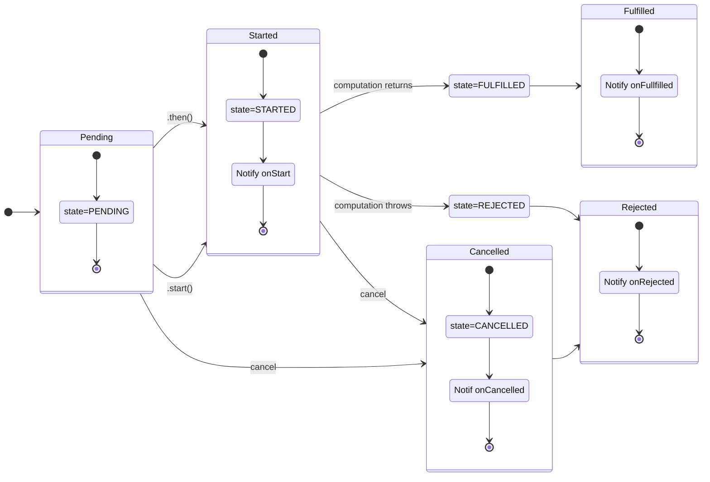
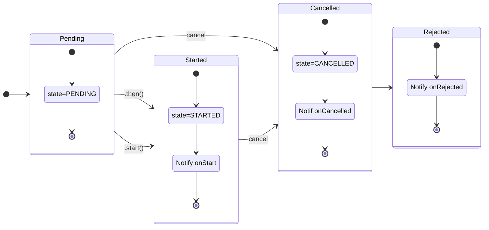
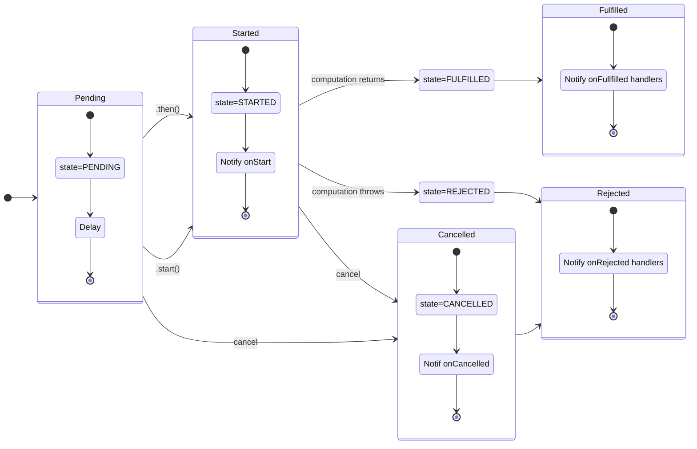
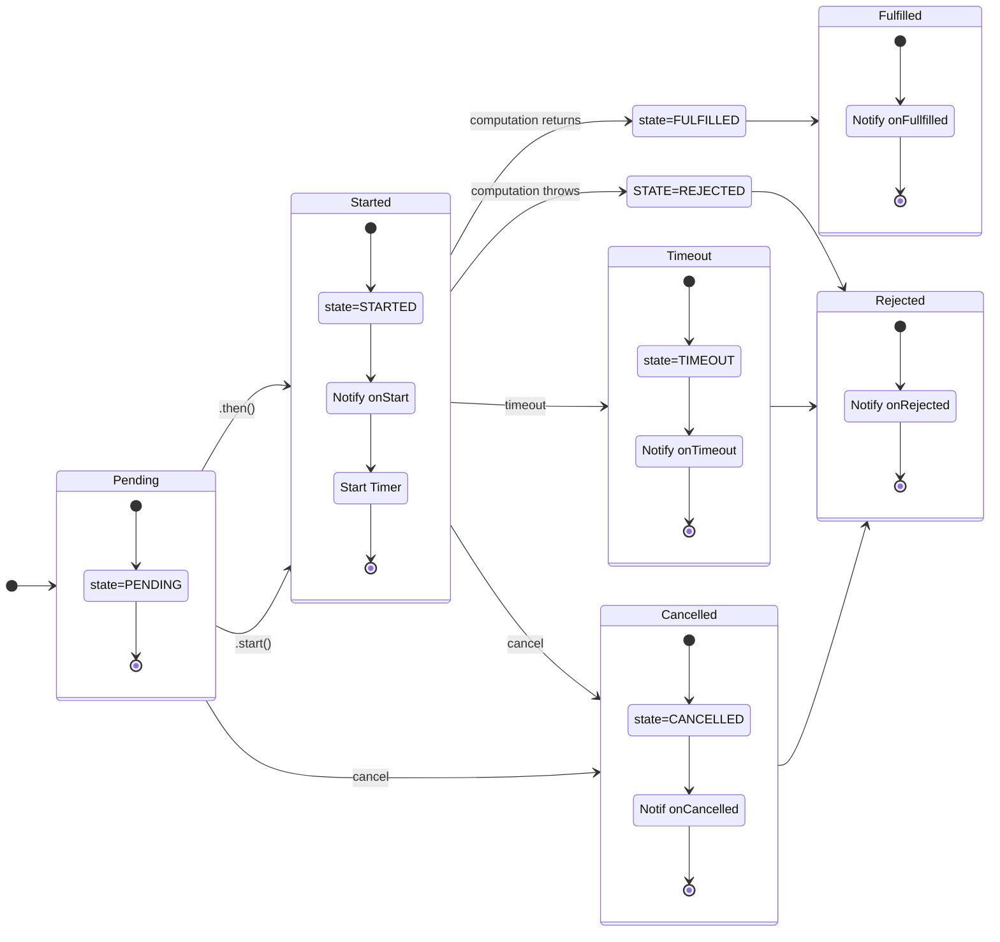
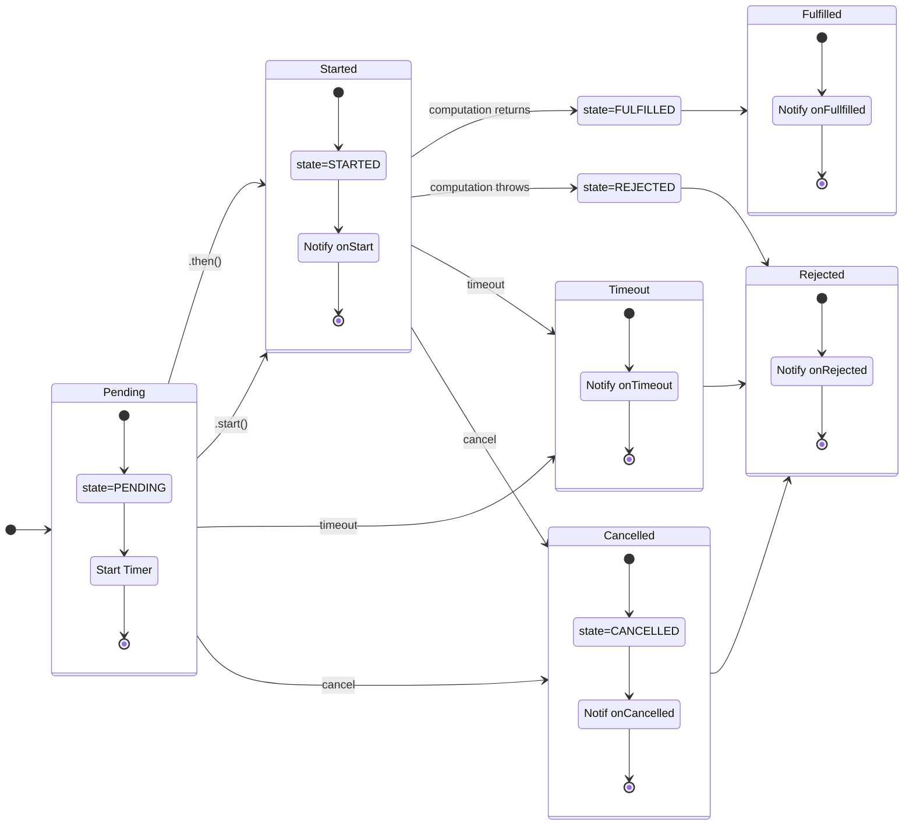

# better-future: Better handling of deferred computation compatible with Promises

## API

### class `Future`

A `Future` is just like a `Promise`, except the computation does not start until and
unless `.then`() is called. It is a _thenable_, and thus can be used anywhere a
`Promise` can be used.

This allows for a form of lazy evaluation, where computations are deferred until needed,
or not performed at all when they may not be needed.

A `Future` can be in one of these states:

* _Pending_: The initial state. The computation has not yet been started.
* _Started_: The computation has been started, but has neither returned nor
  thrown an exception. This corresponds to the _Pending_ state in a `Promise`.
* _Fulfilled_ The computation has returned a value.
* _Rejected_: The computation has thrown an exception or returned a rejected
  `Promise`.
* _Cancelled_: After being cancelled, the `Future` will be in this state until
  all `onCancel` handlers have been called, after which it transitions to
  _Rejected_. `Future`.`state` will remain at `”CANCELLED”` to denote why it
  was rejected.
* _Timeout_: If a `Future` times out (see `Future`.`timeout`()), it will be in
  this state until all `onTimeout` handlers have been called, after which it
  transitions to _Rejected_. `Future`.`state` will remain at `”TIMEOUT”` to
  denote why it was rejected.

  The enueration in `Future`.`state` will be all uppercase.



`.catch`(), `.finally`(), and `.when`() do not result in state changes.

### `new Future`(_computation_)

Creates a `Future` that will begin running _computation_ when `.then`() is called.

_computation_: () => `any`

On creation, the state will be _Pending_.

### _future_.`then`(_onFulfilled_, _onRejected_)

Start the computation running, if it is not already running. When the computation
terminates, _onFulfilled_ or _onRejected_ will be called with the value or error
as with a `Promise`.

The state will transition to _Started_ if it was _Pending_.

### _future_.`catch`(_onRejected_)

If the state is _Fulfilled_, _onRejected_ is called immediately with the rejection value as for `Promise`.`catch`().

If the state is _Fulfilled_, _onRejected_ will not be called.

If the state is _Pending_ or _Started_, and the state becomes _Fulfilled_, _onRejected_ will be called at that time.

### _future_.`finally`(_handler_)

If the state is _Fulfilled_ or _Rejected_, _handler_ will be called. If the state
later transitions to _Fulfilled_ or _Rejected_, the handler will be called at that
time.

### _future_.`when`(_onFulfilled_, _onRejected_)

Like _future_.`then`(), but does not start the computation.

This is useful when setting up a computation and being notified if/when it completes.

### _future_.`start`()

Starts the computation but does not add any handler.

  ```javascript
future.start().when(handler)
```

is equivalent to

```javascript
future.then(handler)
```

### _future_.`onStart`(_handler_)

Regesters a _handler_ that that will be notified that the computation has started.
The _handler_ will receive the time the computation started. Handlers can be added
at any time, including long after the `Future` is resolved.

### _future_.`onTimeout`(_handler_)

Registers a _handler_ that will be notified if the `Future` times out. This can
only happen if the future is creaed with `Future`.`timeoutFromNow`() or
`Future`.`timeout`, or if the computation throws an instance of `Timeout`.

### _future_.`cancel`(_msg_=`‘Cancelled’`)

Cancel a pending or executing `Future`. Does nothing if it has completed.

Canceling a `Future` while the computation is running depends on the computation to
check _future_.`isCancelled`() to actually halt execution, but the `Future`
will be cancelled regardless.



### _future_.`isCancelled`()

Returns `true` if this `Future` has been cancelled, or a `Cancelled` exception
is thrown by the user code.

### _future_.`onCancel`(_handler_)

Registers _handler_ to be called when the `Future` is cancelled. _handler_ will receive a `Cancelled`
error object, from which start and end times may be obtained.

### _future_.`check`(_continuation_)

Checks if the `Future` has been cancelled or timed out. Throws the corresponding
`Cancelled` or `Timeout` exception if so. Otherwise, if _continuation_ is called,
it will be called with the `Future` as an argument.

It is an error to call this from anywhere but an ongoing `Future` computation.

### _future_.`state`

Returns one of:

* `”PENDING”`
* `”STARTED”`
* `TIMEOUT`
* `CANCELLED`
* `”FULFILLED”`
* `”REJECTED”`.

### `Future`.`delay` (_ms_) (_computation_)

Returns a function that when applied to a computation, delays the computation
until a minimum of _ms_ milliseconds have passed.

To immediately start the delay countdown:

```javascript
Future.delay(myComputation).start()
```



### `Future`.`timeout` (_ms_) (_computation_)

Returns a function that when applied to a computation, will return a
`Future` that will time out that computation _ms_ milliseconds after
it is started.



### `Future`.`timeoutFromNow` (_ms_) (_computation_)

Returns a function that when applied to a computation, will return a
`Future` that will time out that computation
_ms_ milliseconds from when when it enters the _Pending_ state.



### `Future`.`resolve`(_value_)

Create a `Future` that is pre-resolved to the specified value. Useful for testing
and for places that expect a full `Future` but you need to supply a resolved value.

### `Future`.`reject`(_error_)

Create a `Future` that is pre-rejected with the specified value. Useful fo resting
and for places that expect a full `Future` but you need to supply a rejected value.

### `Future`.`cancelled`(_msg_ = `Cancelled`)

Return a pre-cancelled `Future`. Useful in testing.

### `Future`.`never`()

Return a `Future` that never arrives. Useful for testing and as a placeholder.

### class `FutureException`

Abstract base class for exceptions relating to`Future`s.

Provides:

* _ex_.`future`: The `Future` for which this was thrown.
* _ex_.`start`: The millisecond time when the `Future` was started (or created).
* _ex_.`end`: The milllisecond time when the exception occured.

### class Timeout

When a `Future` is created with a timeout, it will fail with a `Timeout`
exceeption.

Inherits:

* _ex_.`future`: The Future for which this was thrown.
* _ex_.`start`: The millisecond time when the Future was started (or created).
* _ex_.`end`: The milllisecond time when the exception occured.

### class Cancelled

When a `Future` is cancelled, it will fail with a `Cancelled`
exceeption.

Inherits:

* _ex_.`future`: The `Future` for which this was thrown.
* _ex_.`start`: The millisecond time when the Future was started (or created).
* _ex_.`end`: The milllisecond time when the exception
